# Nova Cart 🛒

A modern e-commerce web application built with **Laravel** and **MySQL**, featuring a full shopping flow (products → cart → checkout → orders), an admin dashboard, and two unique discovery features: **Mood Shop** and **Gift Finder**.

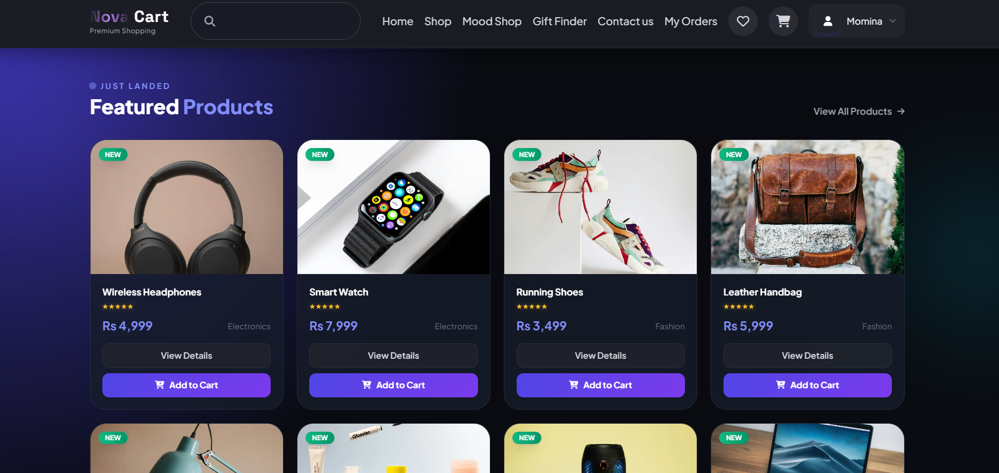

## ✨ Features

- **User authentication & authorization** — registration, login, and protected routes
- **Product & category management** — full CRUD from the admin panel
- **Shopping cart & wishlist** — add, update quantity, remove, move to wishlist
- **Order management** — place orders and track them; admins manage all orders
- **Admin dashboard** — manage products, categories, and orders from one place
- 🎨 **Mood Shop** — discover products based on your current mood
- 🎁 **Gift Finder** — product suggestions by occasion and recipient
- **Responsive UI** — clean Blade templates that work on mobile and desktop

## 🛠 Tech Stack

| Layer | Technology |
|---|---|
| Backend | PHP 8.2+, Laravel 12 |
| Database | MySQL (Eloquent ORM, migrations, seeders) |
| Frontend | Blade templates, CSS, JavaScript |
| Tools | Composer, Git, VS Code |

## 📸 Screenshots

**Login**


**Shop — category & price filters**
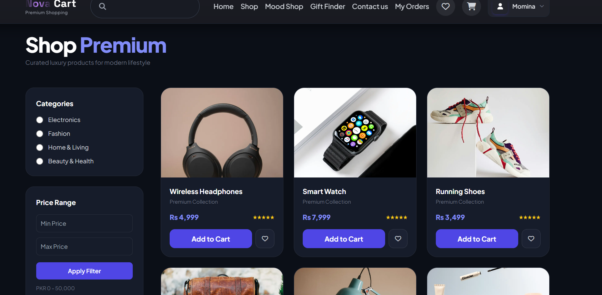

**Product Detail**
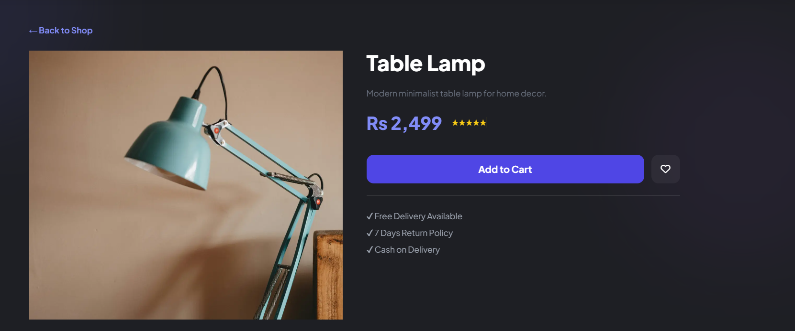

**Wishlist**
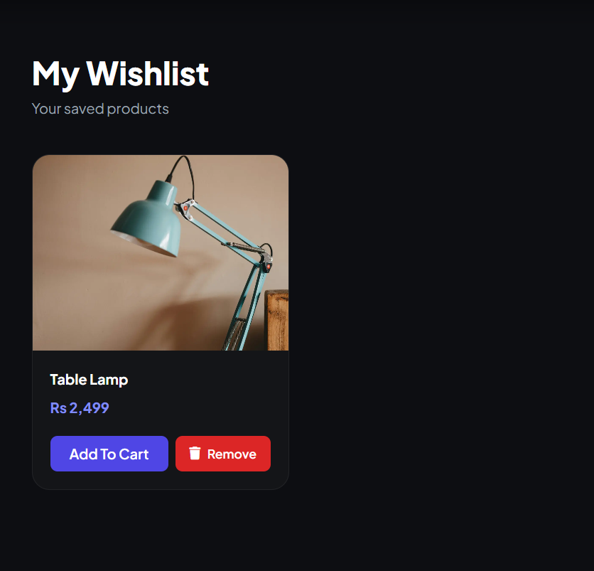

**Shopping Cart**
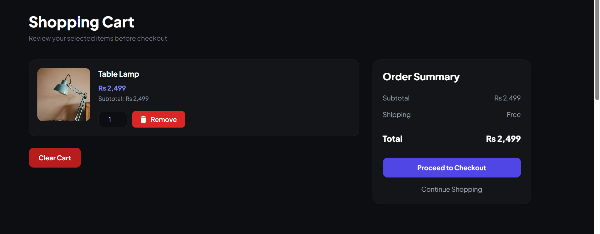

**🎨 Mood Shop — shop by vibe**
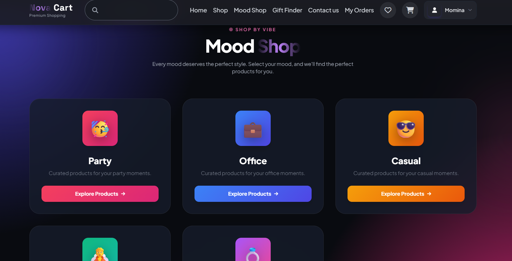

**🎁 Gift Finder — by recipient & occasion**
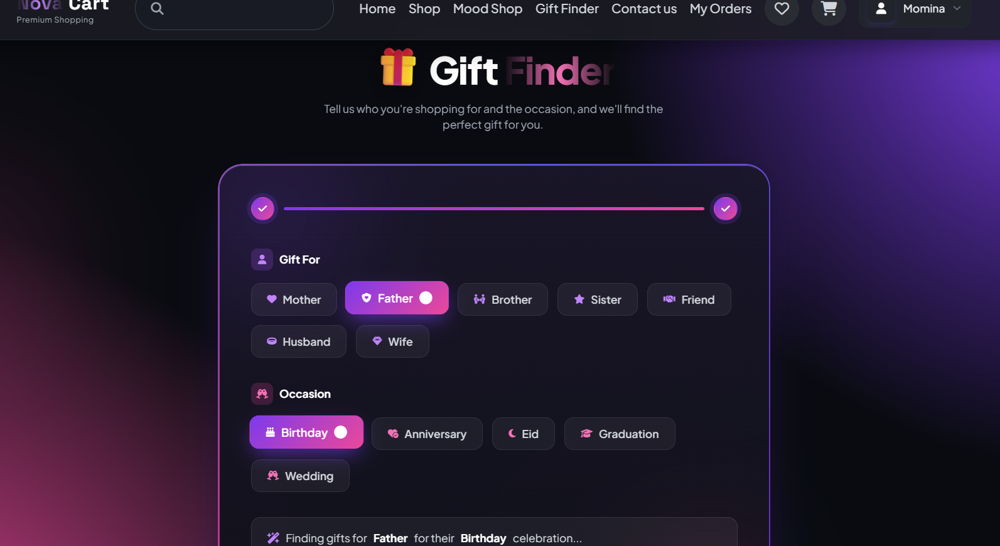

**Order Confirmation (Cash on Delivery)**
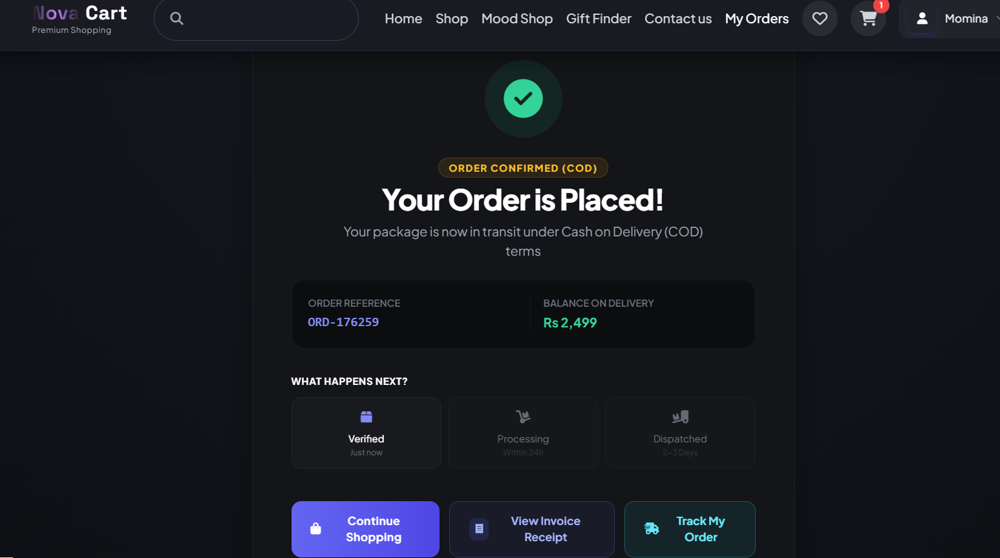

**Order Tracking**
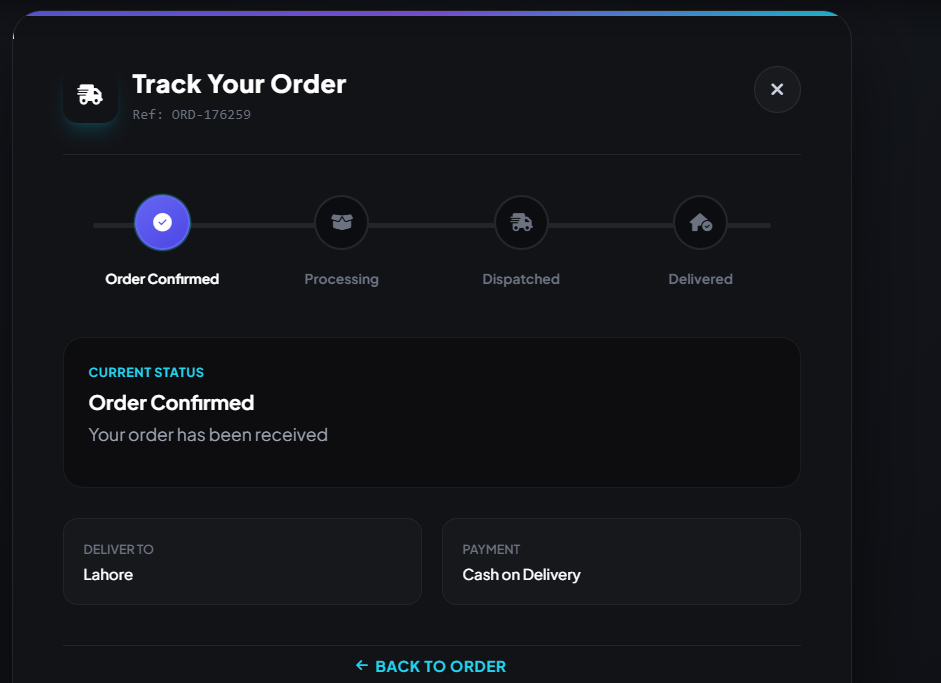

**Admin Dashboard**
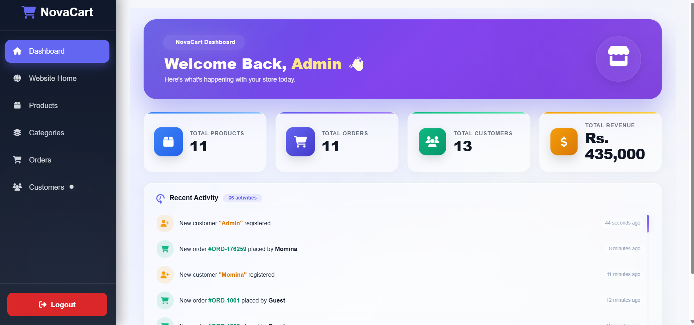

**Admin — Product Management**
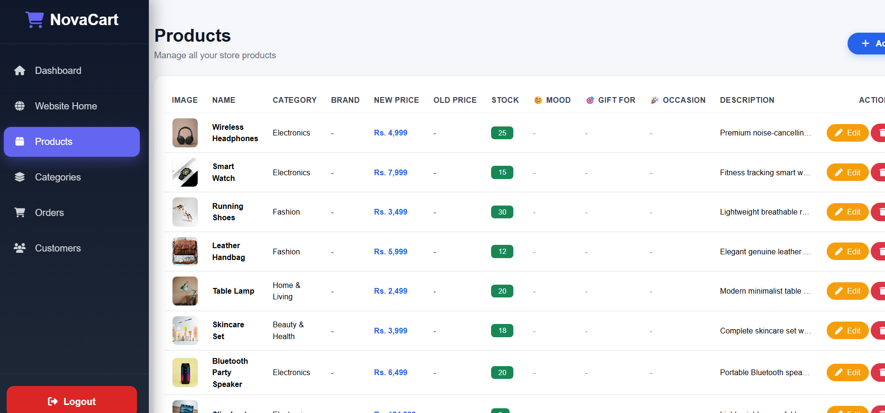

## 🚀 Getting Started

```bash
# 1. Clone the repository
git clone https://github.com/foziatariq213-web/Nova-cart.git
cd Nova-cart

# 2. Install dependencies
composer install

# 3. Set up environment
cp .env.example .env
php artisan key:generate
# open .env and set your MySQL DB_DATABASE / DB_USERNAME / DB_PASSWORD

# 4. Run migrations (and seeders if available)
php artisan migrate --seed

# 5. Start the development server
php artisan serve
```

The app will be available at `http://localhost:8000`.

## 📂 Project Highlights

- MVC architecture with resource controllers and route model binding
- Form Request validation on user input
- Relational database design (products ↔ categories ↔ orders ↔ users)
- Middleware-protected admin routes

## 👩‍💻 Author

**Momina Tariq** — Junior Backend Developer (Laravel)
[LinkedIn](https://www.linkedin.com/in/momina-tariq-dev) · [GitHub](https://github.com/foziatariq213-web)
